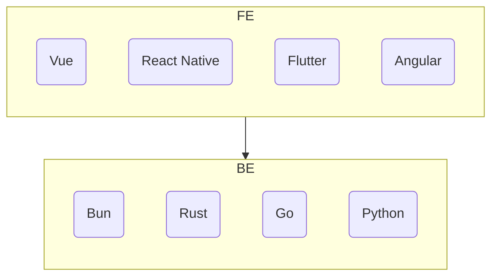

# MLTA

Multi-language Todo App. The purpose of this repository is to learn both backend and frontend languages and build the same application. It consists of the following apps:

All of which implement the basic requirements from https://todomvc.com, [here](https://github.com/tastejs/todomvc/blob/master/app-spec.md#functionality). In the backend the API should provide basic CRUD operations and on the FE, the interface should implement the UI for the basic todo list actions.

One of the requirements of this project is that any frontend can connect to any backend. This means that all implementations should share a common interface at the data layer.

The API schema is defined in Typescript and all other language types are generated with `quicktype`, via the `quicktype schema.ts -o output.[ext]` command.
